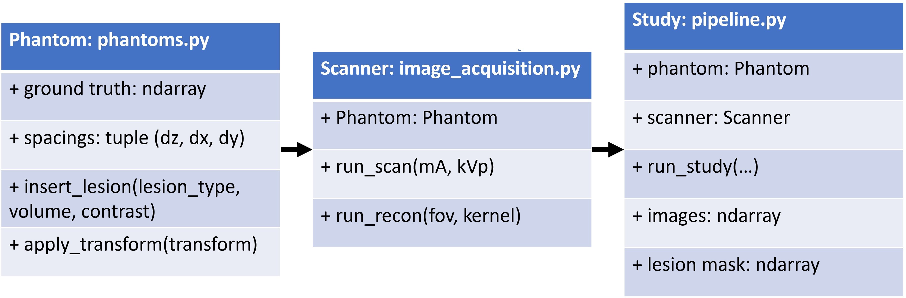

VITools: tools for conducting virtual imaging trials
====================================================

Tools for running virtual imaging trials, including object oriented wrappers for the [XCIST CT Simulation framework](https://github.com/xcist)

IQ phantoms from `pediatricIQphantoms <https://github.com/DIDSR/pediatricIQphantoms>`_

Repositories using `VITools`
---------------------------- 

- `PedSilicoICH <https://github.com/DIDSR/PedSilicoICH>`_ for generating synthetic non contrast CT datasets of intracranial hemorrhage (ICH)
- `PedSilicoLVO <https://github.com/brandonjnelsonFDA/PedSilicoLVO>`_ for generating synthetic large vessel occlusion (LVO) non contrast CT datasets
- `PedSilicoAbdomen <https://github.com/DIDSR/PedSilicoAbdomen>`_ for generating synthetic abdominal non contrast CT datasets of liver metastases
